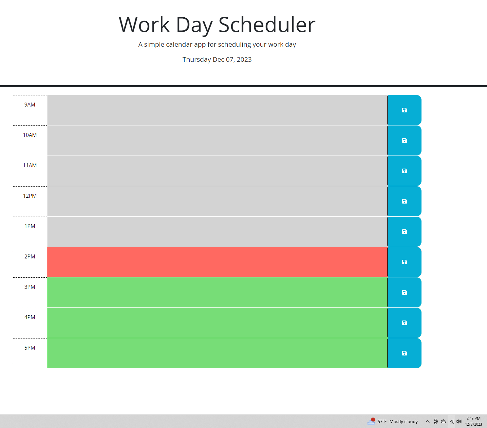
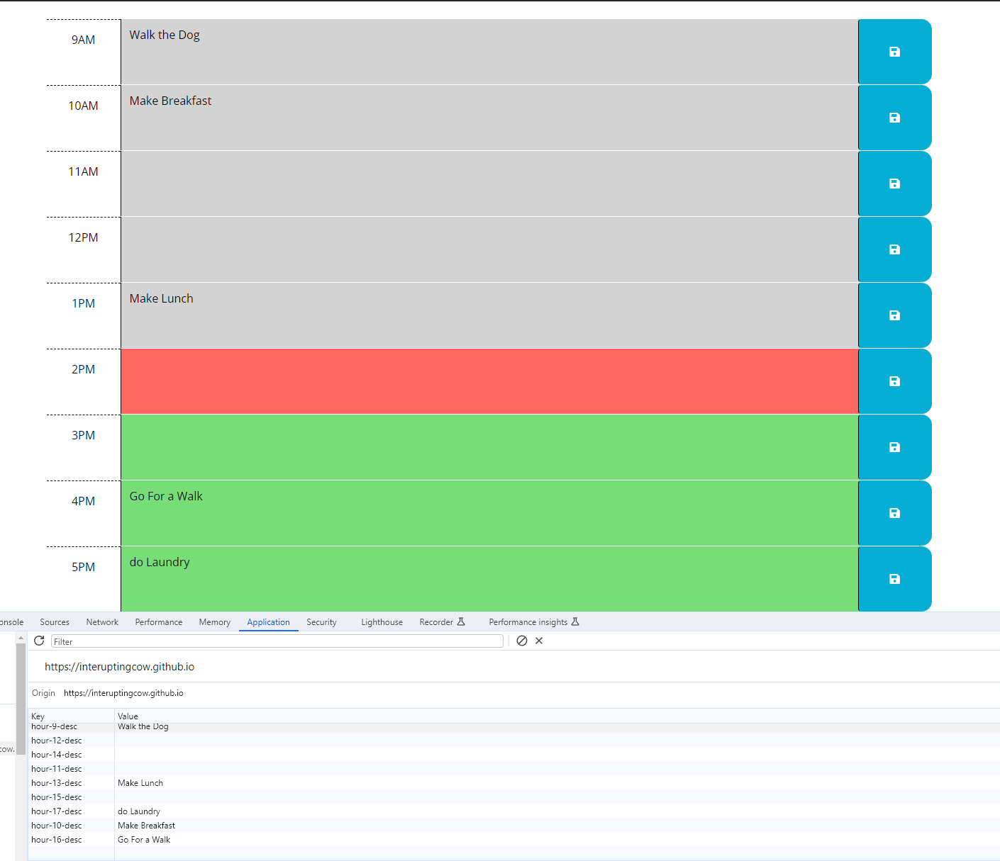

# Workday Scheduler

Workday Scheduler is a simple web application that allows users to plan and organize their workday effectively. With an intuitive interface, users can schedule tasks for each hour, helping them stay on top of their daily responsibilities.

## Features

- **Hourly Schedule:** Plan your day from 9 AM to 5 PM with dedicated time blocks for each hour.
- **Task Management:** Add, edit, and remove tasks for each hour of the workday.
- **Save Functionality:** Save your schedule locally, ensuring your tasks persist when you revisit the page.
- **Responsive Design:** Access and manage your schedule seamlessly on various devices.

## Screenshots

## Getting Started

### Prerequisites

- A modern web browser (Chrome, Firefox, Safari, etc.)

## Usage

1. Open the Workday Scheduler in your web browser.
2. Review the hourly schedule blocks.
3. Click on the text area for a specific hour to add or edit tasks.
4. Click the "Save" button to save your tasks for that hour.
5. Your schedule is automatically saved and can be retrieved when you revisit the page.
